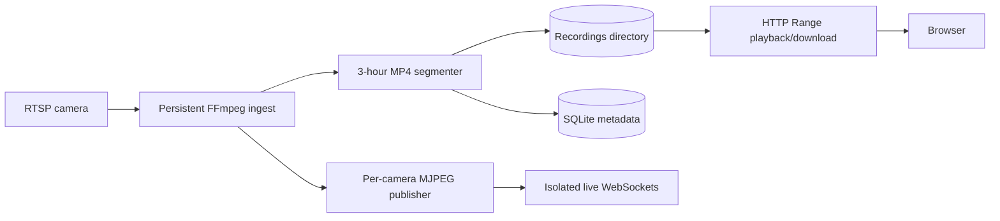
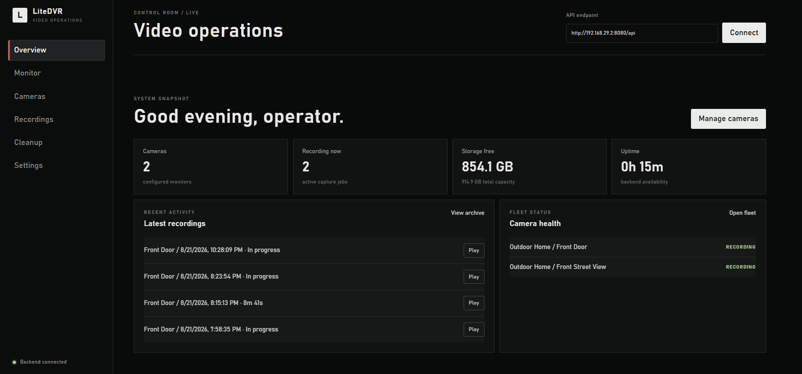
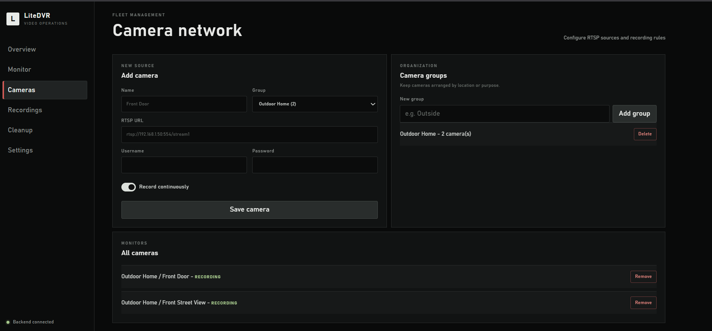
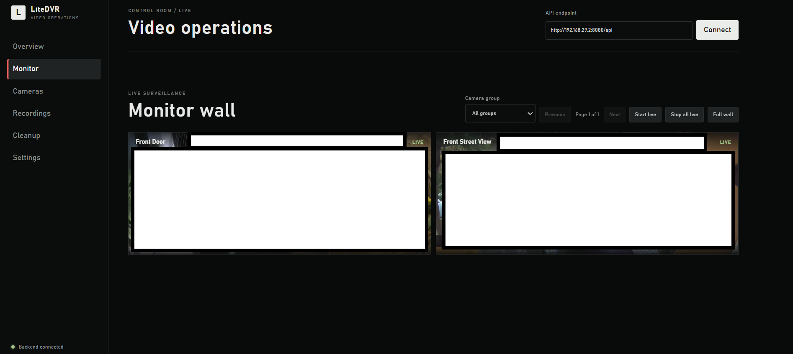
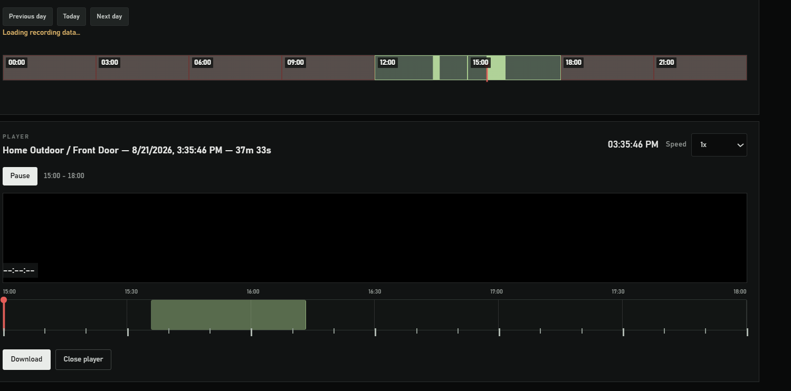

# LiteDVR

LiteDVR is a small self-hosted DVR for low-resource Debian hosts. It records RTSP H.264/H.265 streams using FFmpeg packet copy (-c copy): normal recordings are never decoded or transcoded.

The project includes TOML/environment configuration, SQLite metadata, CRUD camera/group management, supervised per-camera recording, retention cleanup, HTTP Range MP4 playback, isolated live/playback sockets, and a detached frontend.

## How the recorder works

Each enabled camera has one persistent FFmpeg ingest. It keeps the RTSP
connection open while a segment muxer writes native-resolution, packet-copied
MP4 files in three-hour cuts. Live viewers receive an isolated MJPEG WebSocket
subscription from the same camera pipeline; closing a viewer does not stop
recording or create another camera connection. Playback and downloads are
served by the backend from stored MP4 files, never directly from the camera.

## Screenshots

The web interface includes camera configuration, live monitoring, recording
playback, and the system overview dashboard.

### Overview

### Camera configuration

### Monitor wall

### Recordings and playback

## Running LiteDVR as a systemd service

Use this deployment mode only when FFmpeg and the LiteDVR backend should run
directly on Debian rather than in Docker. Choose either this native mode or
the Docker Compose mode below; do not run both on port `8080` at the same
time. If you use Docker Compose, leave the native `litedvr.service` disabled.

Install the runtime and create the service account:

    sudo apt update
    sudo apt install -y python3-venv ffmpeg
    sudo useradd --system --create-home --home-dir /opt/litedvr litedvr || true
    sudo mkdir -p /opt/litedvr /var/lib/litedvr/recordings /etc/litedvr
    sudo chown -R litedvr:litedvr /opt/litedvr /var/lib/litedvr

Install LiteDVR from the checked-out project:

    sudo python3 -m venv /opt/litedvr/.venv
    sudo /opt/litedvr/.venv/bin/pip install .
    sudo cp config.example.toml /etc/litedvr/config.toml
    sudo chown litedvr:litedvr /etc/litedvr/config.toml

Review `/etc/litedvr/config.toml` (RTSP cameras, bind address, and recording
path), then install and start the included unit:

    sudo cp systemd/litedvr.service /etc/systemd/system/litedvr.service
    sudo systemctl daemon-reload
    sudo systemctl enable --now litedvr
    sudo systemctl status litedvr --no-pager

Useful diagnostics:

    journalctl -u litedvr -f
    systemctl restart litedvr
    systemctl stop litedvr

### Keep recording when the laptop lid closes

Configure systemd-logind to ignore lid events. This keeps the machine awake
when the lid is closed (ensure it has adequate ventilation):

    sudo mkdir -p /etc/systemd/logind.conf.d
    sudo tee /etc/systemd/logind.conf.d/10-litedvr-lid.conf >/dev/null <<'EOF'
    [Login]
    HandleLidSwitch=ignore
    HandleLidSwitchExternalPower=ignore
    HandleLidSwitchDocked=ignore
    EOF
    sudo systemctl restart systemd-logind

Verify the effective settings with:

    loginctl show-logind -p HandleLidSwitch -p HandleLidSwitchExternalPower -p HandleLidSwitchDocked

If the laptop still suspends, also check desktop power-management settings and
the BIOS/firmware power policy. Keep the laptop ventilated while closed.

## Docker deployment

Copy `.env.example` to `.env`, set `LITEDVR_DATA_DIR` to a directory with enough disk space, then pull and start the stack:

    docker pull pranavdarshan1/litedvr:latest
    docker pull pranavdarshan1/litedvr-frontend:latest
    docker compose up -d

On Debian systems without the Compose V2 plugin, install `docker-compose` and
run the same commands with a hyphen (`docker-compose pull`,
`docker-compose up -d`).

The published images are used by default:

    pranavdarshan1/litedvr:latest
    pranavdarshan1/litedvr-frontend:latest

### Published Docker images

The complete application is distributed as these two images:

| Image | Purpose |
| --- | --- |
| [`pranavdarshan1/litedvr:latest`](https://hub.docker.com/r/pranavdarshan1/litedvr) | Backend API, recorder, FFmpeg integration, and MP4 playback |
| [`pranavdarshan1/litedvr-frontend:latest`](https://hub.docker.com/r/pranavdarshan1/litedvr-frontend) | Nginx-hosted web interface |

Pull both images explicitly when preparing a host:

    docker pull pranavdarshan1/litedvr:latest
    docker pull pranavdarshan1/litedvr-frontend:latest

The Compose file starts both images together and exposes the frontend on
port `8081` and the backend API on port `8080`.

New segmented recordings are stored below
`<data-directory>/recordings/<group>/<camera>/segments`. Existing recordings
are preserved during upgrades; the database and recordings directory are
never part of a Docker image.

Compose is the recommended service manager for the container deployment. Both
services use `restart: unless-stopped`, so Docker restarts them after a crash
and starts them again when the Docker daemon starts after a reboot:

    sudo systemctl enable --now docker
    docker-compose up -d
    docker-compose ps

Confirm the restart policy:

    docker inspect -f '{{.HostConfig.RestartPolicy.Name}}' litedvr
    docker inspect -f '{{.HostConfig.RestartPolicy.Name}}' litedvr-frontend

Both commands should print `unless-stopped`. To stop the optional native
systemd service before using Docker Compose:

    sudo systemctl disable --now litedvr

For a local source build instead of Docker Hub images, run `docker-compose up -d --build`.

Open `http://<debian-host>:8081`. The backend is on port 8080 and the frontend on port 8081. The database and MP4 files are persisted under `LITEDVR_DATA_DIR`; do not remove that directory during upgrades.

The default deployment target is `linux/386` for the requested 32-bit Debian laptop. If the host is amd64 or arm64, set `LITEDVR_PLATFORM` in `.env` to that platform before building. Docker itself must be available on the Debian host; a 32-bit userspace cannot run a 64-bit-only Docker engine.

For a no-Docker local test on Windows, use config.local-test.toml and run the backend on port 8080 plus a static server for frontend on port 8081. The configuration UI lets you add groups and RTSP cameras; start with a disabled camera or a known RTSP endpoint.

The detached frontend includes a recordings view with filters, a metadata-based timeline, standard HTML5 MP4 playback, seeking through Range requests, download links, and isolated live camera subscriptions. It never connects directly to an RTSP camera.

Maintainers can publish updated images from a build machine with:

    docker login
    docker buildx build --platform linux/386,linux/amd64 -t <namespace>/litedvr:latest --push .
    docker buildx build --platform linux/386,linux/amd64 -t <namespace>/litedvr-frontend:latest --push ./frontend

The i386 image must be built on native i386 or with Buildx emulation, and should be tested with one camera before adding more.

Before adding a real camera, run scripts/probe-target.sh on the i386 Debian machine. It checks architecture, Python packages, FFmpeg, and RTSP support. Then use one real camera and inspect CPU/RSS before enabling more cameras.

See INSTALL.md, CONFIGURATION.md, and ARCHITECTURE.md.

For a reusable AI prompt and repository-specific troubleshooting context, see
[LLM_GUIDE.md](LLM_GUIDE.md).
